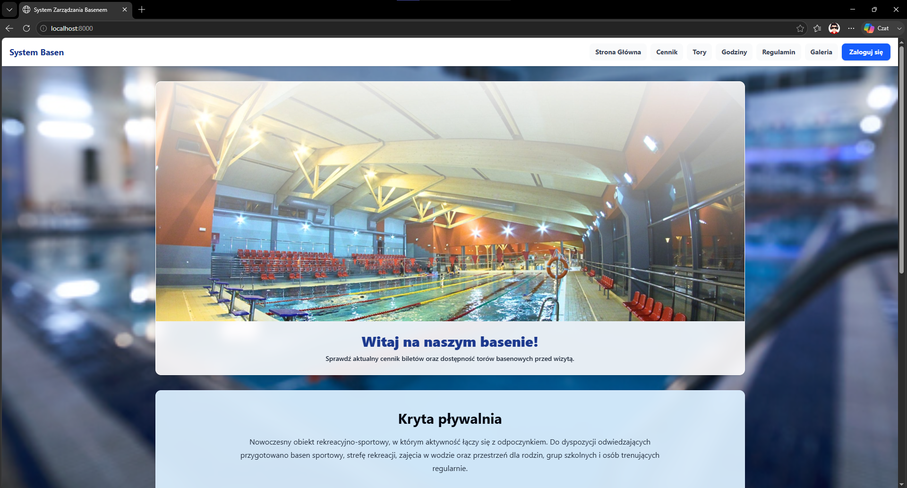
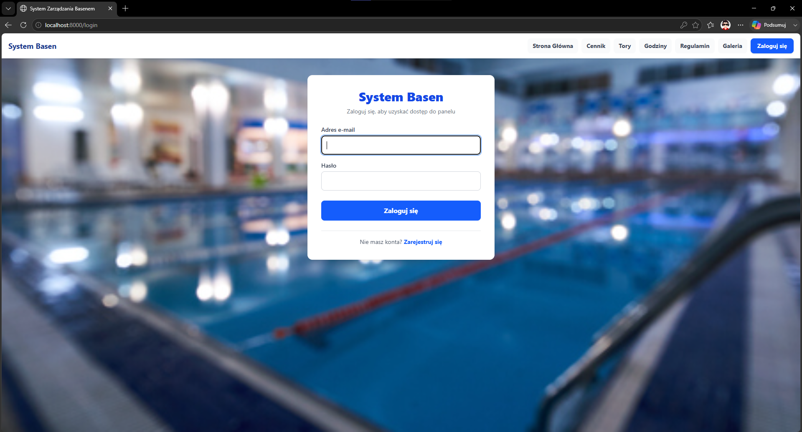
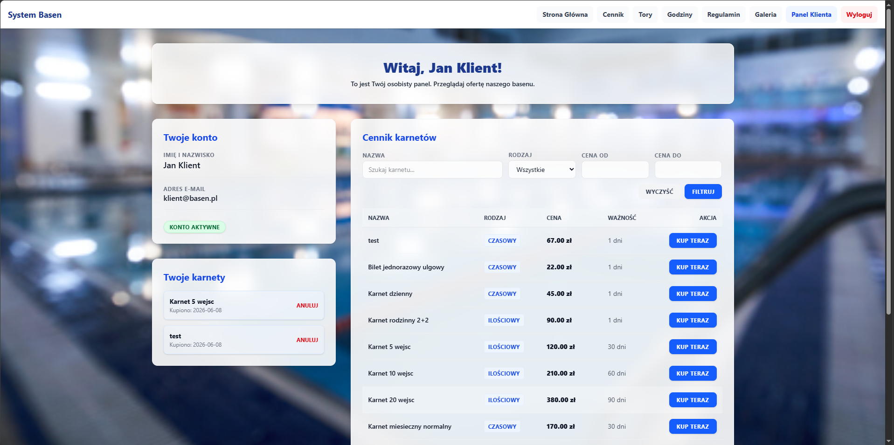

[README.md](https://github.com/user-attachments/files/28729196/README.md)
# System Zarządzania Basenem

## Temat projektu

**System Zarządzania Basenem** to aplikacja internetowa przygotowana w Laravelu do obsługi podstawowych zasobów obiektu basenowego. System udostępnia publiczne informacje dla odwiedzających oraz panel klienta i administratora.

Aplikacja pozwala sprawdzić cennik, dostępność torów, godziny otwarcia, regulamin oraz galerię obiektu. Po zalogowaniu klient może kupować i anulować karnety, a administrator zarządza danymi w systemie.

## Główne funkcje

### Użytkownik niezalogowany

- przeglądanie strony głównej z opisem basenu i aktualnościami,
- sprawdzanie cennika karnetów,
- podgląd dostępności torów,
- sprawdzanie godzin otwarcia,
- przeglądanie regulaminu i galerii,
- przejście do logowania lub rejestracji.

### Klient

- logowanie do panelu klienta,
- podgląd danych konta,
- przeglądanie cennika,
- filtrowanie karnetów po nazwie, rodzaju i cenie,
- zakup wybranego karnetu,
- anulowanie posiadanego karnetu.

### Administrator

- dodawanie, edycja i usuwanie karnetów,
- zarządzanie klientami,
- dodawanie i usuwanie pracowników,
- zmiana statusu torów,
- filtrowanie i sortowanie danych,
- kontrola podstawowych zasobów systemu.

## Technologie

| Element | Technologia |
| --- | --- |
| Backend | PHP, Laravel 13 |
| Frontend | Blade, Tailwind CSS |
| Baza danych | PostgreSQL |
| Serwer lokalny | XAMPP / Artisan |
| Zależności | Composer, npm |

## Uruchomienie projektu

1. Pobierz plik `System_Basen.7z` i wypakuj projekt.
2. Przejdź do katalogu aplikacji:

```bash
cd "C:\xampp\htdocs\System Basen\basen-laravel"
```

3. Zainstaluj zależności PHP:

```bash
composer install
```

Jeżeli komenda `php` nie działa globalnie, można użyć PHP z XAMPP:

```bash
C:\xampp\php\php.exe artisan serve
```

4. Skonfiguruj plik `.env` i połączenie z bazą danych PostgreSQL.
5. Zaimportuj bazę z pliku `basen_db.sql` albo uruchom migracje.
6. Uruchom projekt:

```bash
php artisan serve
```

Adres aplikacji:

```text
http://localhost:8000
```

## Dane testowe

| Rola | E-mail | Hasło |
| --- | --- | --- |
| Administrator | `admin@basen.pl` | `admin123` |
| Klient | `klient@basen.pl` | `haslo1234` |

## Wizualny opis interfejsu

### Strona główna



Strona główna pokazuje opis krytej pływalni, aktualności oraz górne menu z publicznymi zakładkami. Użytkownik może przejść do cennika, torów, godzin, regulaminu, galerii lub logowania.

### Logowanie



Ekran logowania pozwala wpisać adres e-mail i hasło. Po poprawnym zalogowaniu użytkownik trafia do panelu klienta albo administratora, zależnie od roli konta.

### Panel klienta



Panel klienta pokazuje dane konta, posiadane karnety oraz cennik. Klient może filtrować karnety, kupić wybrany karnet albo anulować już posiadany.

## Pliki w repozytorium

- `System_Basen.7z` - skompresowany projekt aplikacji,
- `basen_db.sql` - eksport bazy danych,
- `Dokumentacja.7z` - dokumentacja projektu,
- `strona_glowna.png`, `logowanie.png`, `klient_zalogowany.png` - zrzuty ekranu użyte w README.

## Status projektu

Projekt realizuje podstawową funkcjonalność CRUD wymaganą na ocenę 3.0. Administrator zarządza zasobami, a klient może korzystać z panelu i kupować karnety.
